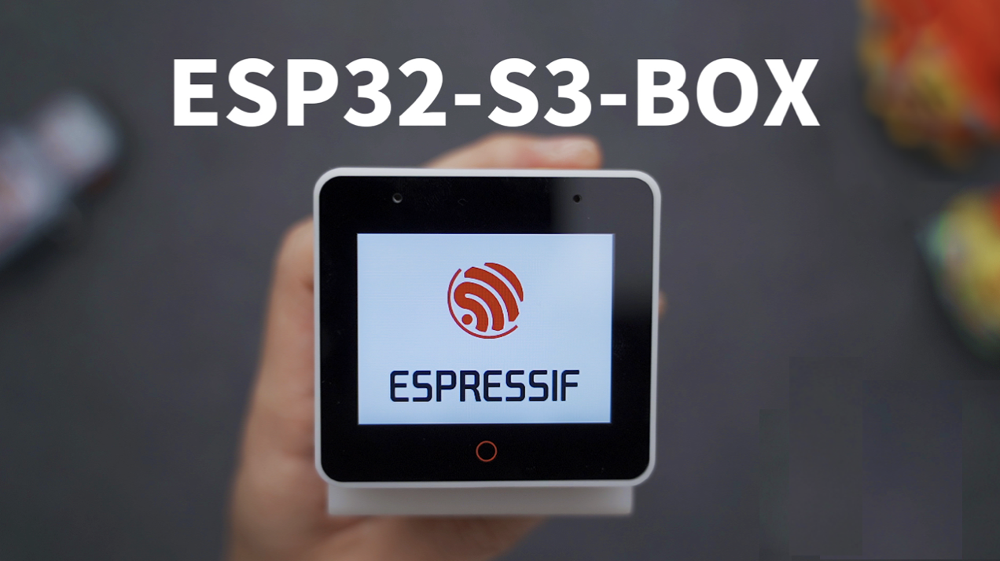
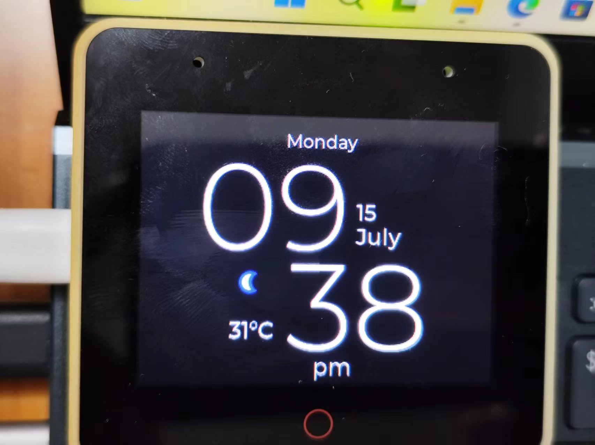
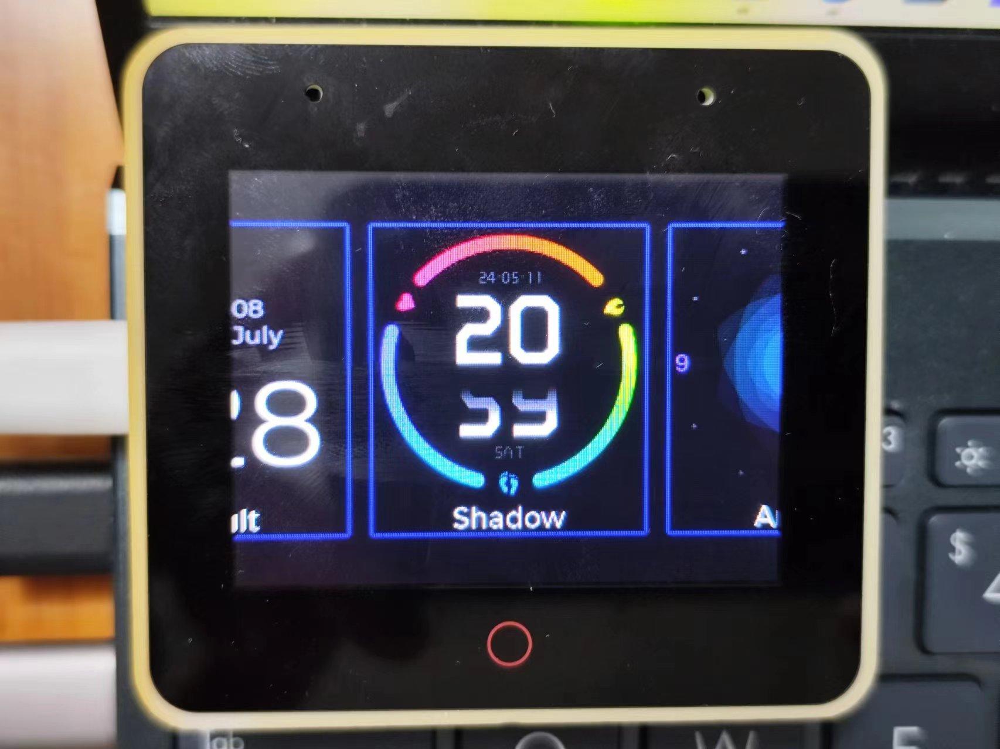
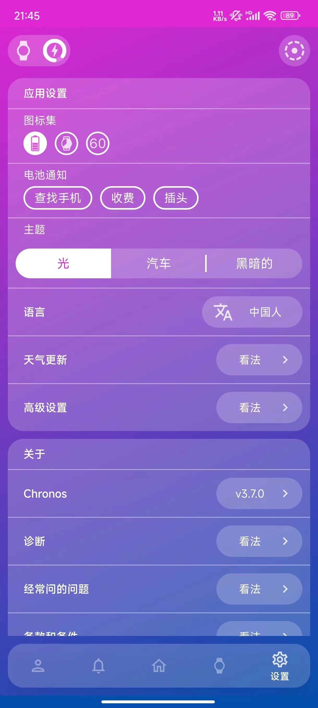

# 基于ESP32S3BOX 手表UI
开发环境 platformio

来源
[参考来源](https://github.com/fbiego/esp32-c3-mini)
# 硬件 ESP-BOX
[ESP-BOX](https://github.com/espressif/esp-box)

## 效果


# 手机app



# 功能列表
- [√]时钟
- [√]天气
- [√]手机音乐控制
- []deck

# ERROR
```shell
[Warn]	(0.000, +0)	 lv_timer_handler: It seems lv_tick_inc() is not called. 	(in lv_timer.c line #94)
```
修改lvgl lv_conf.h 89 line

```c
#define LV_TICK_CUSTOM 1
```
